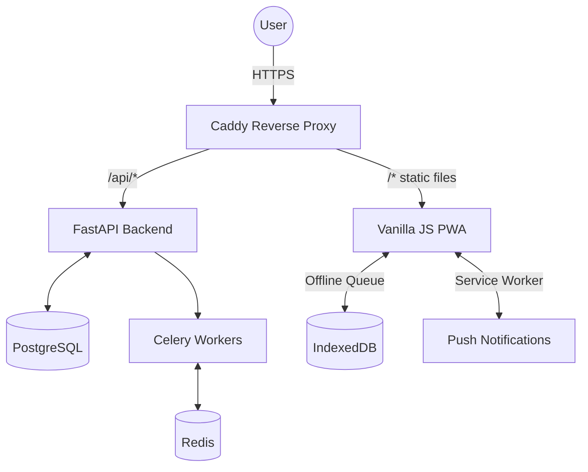

# IRONLOG — Gym Progress Analytics

**Live at: [ironlog.in](https://ironlog.in)**

A full-stack, multi-user fitness tracker: body weight, lifts, and calories in, real trend analysis out. Built with a robust backend and a blazing-fast vanilla frontend, deployed autonomously via CI/CD.

## 📸 App Preview

<div align="center">
  
  &nbsp;&nbsp;
  
</div>

## 🏗 System Architecture



## Tech Stack & Infrastructure

- **Backend**: Python, FastAPI, SQLAlchemy, Alembic
- **Database**: PostgreSQL (Production) & SQLite (Testing)
- **Background Jobs**: Celery + Redis (for asynchronous emails and push notifications)
- **Frontend**: Vanilla HTML, CSS, JavaScript (Zero build step, Chart.js for visualizations, Service Workers for PWA functionality)
- **Infrastructure**: Hosted on AWS EC2, fully containerized with Docker & Docker Compose
- **Web Server**: Caddy (acts as a reverse proxy and automatically provisions SSL/TLS certificates via Let's Encrypt for secure HTTPS)
- **Security & Reliability**: HttpOnly secure cookies (no XSS-vulnerable localStorage tokens), strict CORS, SlowAPI rate-limiting (proxy-aware), and Sentry exception tracking (with PII scrubbing).
- **CI/CD**: GitHub Actions. Every push to the `main` branch spins up a fresh test database, tests Alembic migration paths, runs the comprehensive Pytest suite (70+ tests), and upon success, automatically deploys to EC2.

## Features & Analytics

Nothing here is decorative — every number on screen comes from a tested formula:

- **Estimated 1RM** — Epley formula (`weight × (1 + reps/30)`), the standard used by most lifting trackers for rep ranges up to ~10-12.
- **BMR / Formula TDEE** — Mifflin-St Jeor equation × activity multiplier.
- **True Maintenance Calories** — Back-calculated from *your own* logged calories and *your own* real weight change (using ~7700 kcal per kg of body mass). Needs at least 10 overlapping days of calorie + weight logs.
- **Weekly Weight Trend** — Linear regression over your last 28 days of weigh-ins, smoothing out daily fluctuations.
- **Strength Level** (Beginner → Elite) — Approximate, bodyweight-ratio-based classification for major lifts.
- **Compare to Past You** — Real-time period-over-period delta tracking (7, 30, 90 days, 1 year) comparing training volume, new PRs hit, and consistency metrics to prove your hard work is paying off.
- **ETA Forecasting** — Linear regression models predict exactly what date you'll hit a target weight for a given exercise based on your recent 1RM trajectories.
- **AI Coach** — Uses Gemini to analyze your recent logs, strength levels, and trends, providing actionable feedback tailored to your progress.
- **Push Notifications** — Opt-in native web push notifications to keep you on track with your routines and goals.
- **GDPR Export** — Instantly export your entire IRONLOG database footprint as raw JSON or a fully flattened multi-sheet CSV, heavily tested and secured against spreadsheet macro-injection attacks (CWE-1236).
- **Progressive Web App (PWA)** — Installable on iOS/Android home screens for a native app feel, complete with optimized offline IndexedDB request queueing and skeleton loading states.

## Premium UI / UX

- **Collapsible Sidebar**: Fully responsive layout with a collapsible sidebar. The toggle state is persisted in the database, syncing your preference across devices.
- **Mobile First**: Shifts to a sleek bottom navigation bar on mobile devices.
- **Custom Duotone Icons**: Hand-crafted, premium SVG duotone icons (frosted-glass style) for a rich, top-tier SaaS aesthetic.
- **Dark Mode Palette**: The palette is pulled from IPF/IWF weight-plate colors (25kg=red, 20kg=blue, 15kg=yellow/gold, 10kg=green) on a warm graphite background — grounded in the lifter's actual world.

## Project Structure

```
gym-progress-analytics/
├── backend/                 FastAPI + SQLAlchemy + Alembic + Celery
│   ├── app/
│   │   ├── main.py          App entrypoint, CORS, router wiring
│   │   ├── models.py        SQLAlchemy models & table composite indexes
│   │   ├── schemas.py       Pydantic request/response schemas
│   │   ├── calculations.py  All formulas - isolated & unit-tested
│   │   ├── worker.py        Celery worker for async tasks (Brevo, Push)
│   │   └── routers/         auth, profile, weight, exercises, lifts, etc.
│   ├── tests/               Comprehensive Pytest suite
│   ├── alembic/             Database migration scripts
│   ├── requirements.txt
│   ├── Dockerfile
│   └── .env.example
├── frontend/                 Vanilla HTML/CSS/JS (no build step)
│   ├── index.html            Login / register
│   ├── dashboard.html        Overview, streak, insights
│   ├── sw.js                 Service Worker for Push Notifications
│   ├── css/                  Design system, themes, mobile breakpoints
│   └── js/                   API clients, offline queues, layout, Chart.js
├── docker-compose.yml        Local and production container orchestration
├── Caddyfile                 Reverse proxy & SSL configuration
└── .github/workflows/ci.yml  Automated CI/CD pipeline (Tests -> Deploy)
```

## Running Locally (Docker)

The absolute easiest way to run the entire stack locally is using Docker Compose:

```bash
docker compose up -d --build
```

- **Frontend**: Available at `http://localhost:8080`
- **Backend API Docs**: Available at `http://localhost:8000/docs`. **Note for reviewers:** The backend is built with FastAPI, which *auto-generates* self-documenting, interactive Swagger/OpenAPI documentation. Simply navigate to `/docs` while the server is running to explore and test the entire API.

## Manual Local Setup

If you prefer to run it without Docker:

**Backend**:
```bash
cd backend
pip install -r requirements.txt
alembic upgrade head
uvicorn app.main:app --reload

# Start Redis locally (required for Celery)
# In another terminal:
celery -A app.worker.celery_app worker --loglevel=info
```

**Frontend**:
```bash
cd frontend
python3 -m http.server 8080
```
Open `http://127.0.0.1:8080`.

## Automated Deployments (CI/CD)

This project features a fully automated deployment pipeline. When code is pushed to the `main` branch, a GitHub Action is triggered:
1. Provisions a test environment and verifies Alembic database migrations.
2. Runs the full backend Pytest suite.
3. Upon success, logs into the EC2 instance via SSH.
4. Pulls the latest changes from `main`.
5. Runs `docker compose up -d --build` to seamlessly update the live application.
6. Caddy handles routing for **ironlog.in** and maintains secure HTTPS connections automatically via Let's Encrypt.
